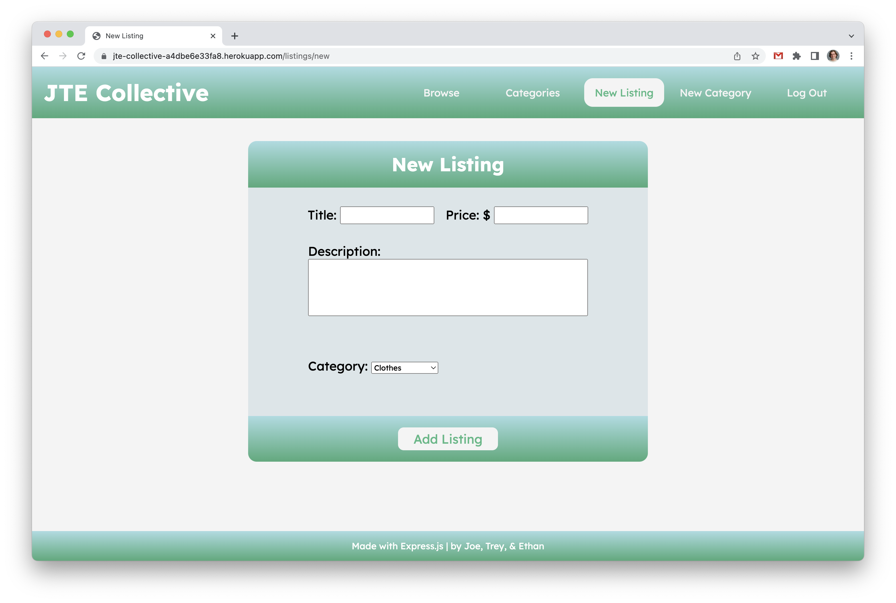
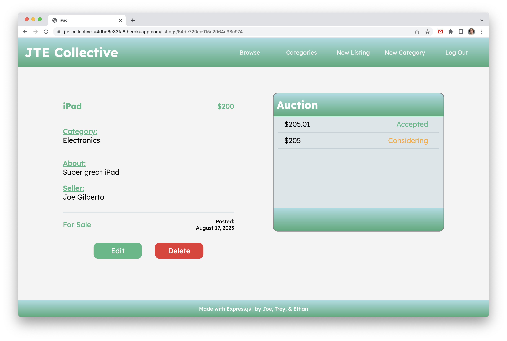
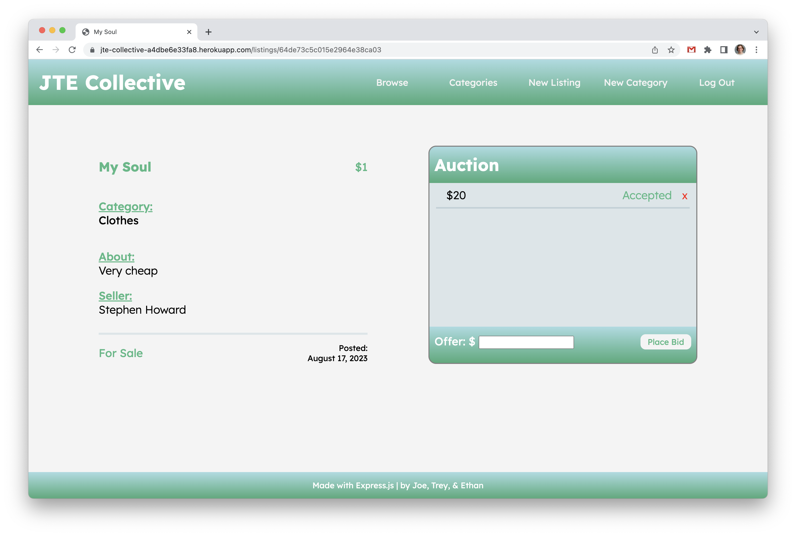
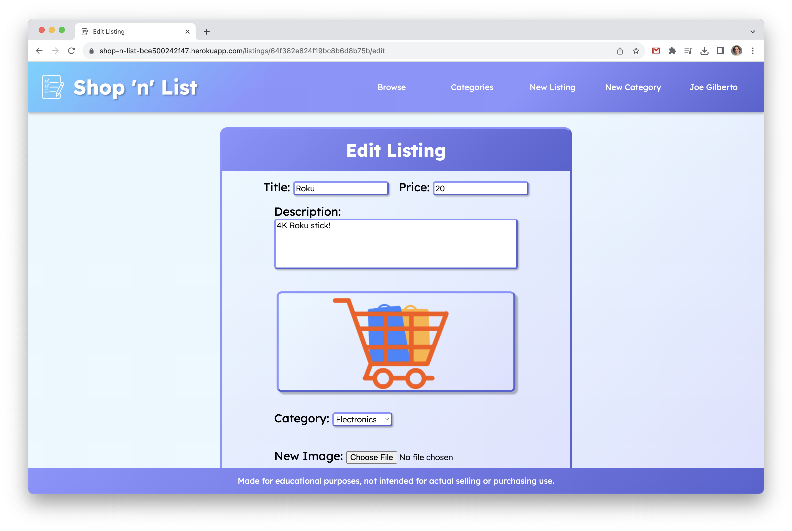
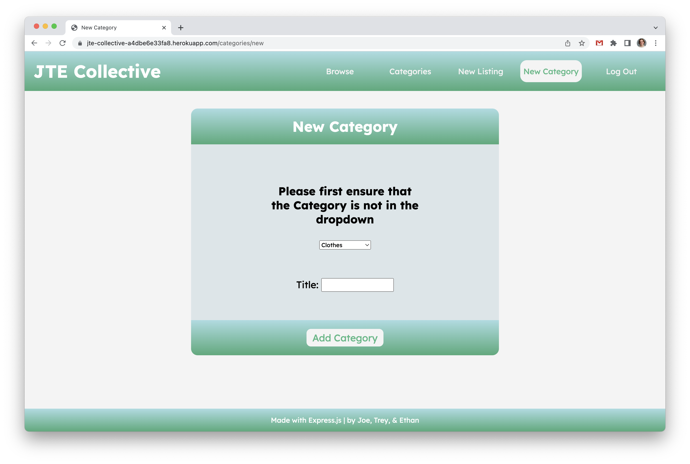

# JTE-Collective
An Express.js web application that allows users to login, post listings for sale, and for other users to bid on said listings.

# Screenshot

### All Listings

### New Listing

### Individual Listing

### Bid on Listing

### Edit Listing

### New Category

# Technologies Used

- JavaScript
- HTML
- CSS
- MognoDB
- Mongoose
- Express.js
- Node.js
- EJS
- Dotenv
- Method Override
- Passport

# Resources
- [GA Google OAuth Tutorial](https://git.generalassemb.ly/SEIR-710-EC/Course-Materials/blob/main/02_Lesson_Materials/Unit_2/resources/9-authentication/9.1-oauth-authentication-full.md)
- [MDN Web Docs](https://developer.mozilla.org/en-US/)
- [W3 Schools](https://www.w3schools.com/)
- [StackOverflow](https://stackoverflow.com/)

# Getting Started

[Click to start shopping!](https://jte-collective-a4dbe6e33fa8.herokuapp.com/)

JTE Collective invites you to login with your Google credentials.  Once logged in, you can create listings to sell items, bid on other people's listings, and even create new categories of items to sell in.

Owners of listings also have the functionality to edit or delete their posts, and bidders can delete their auction bids as well.

# Next Steps

- Adding a category show page, to show all listings in a category.
- Adding images to listings so listers can show off their wares.
- Add an expiration to listings.