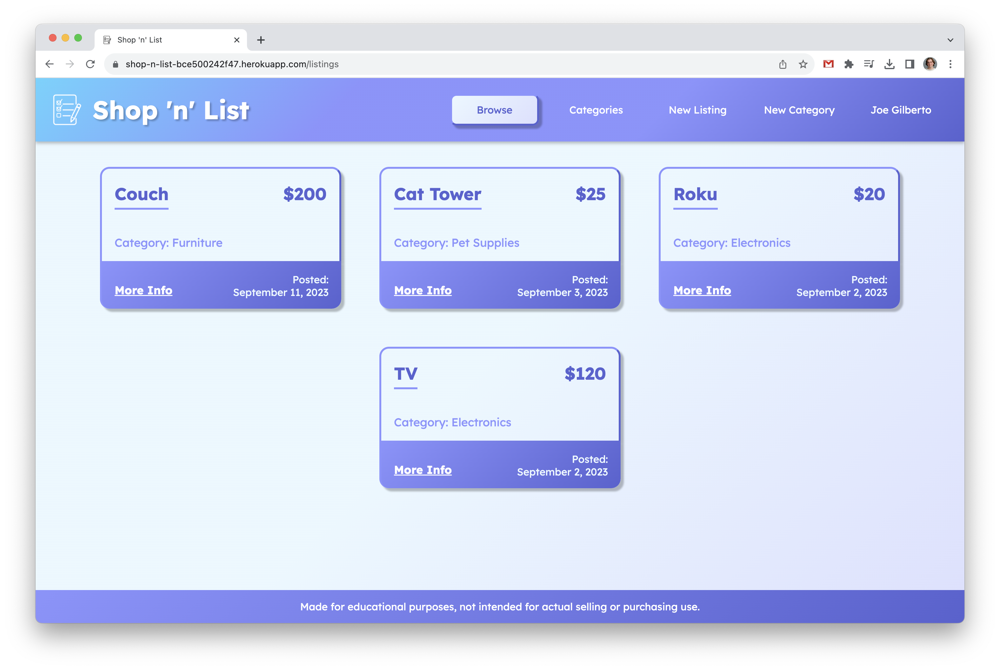

# JTE-Collective
An Express.js web application that allows users to login, post listings for sale, and for other users to bid on said listings.

# Screenshot

### All Listings

### New Listing

### Individual Listing

### Edit Listing

### All Categories

### New Category

# Technologies Used

- JavaScript
- EJS
- CSS
- MognoDB
- Mongoose
- Express.js
- Node.js
- Dotenv
- Method Override
- Passport

# Resources
- [GA Google OAuth Tutorial](https://git.generalassemb.ly/SEIR-710-EC/Course-Materials/blob/main/02_Lesson_Materials/Unit_2/resources/9-authentication/9.1-oauth-authentication-full.md)
- [MDN Web Docs](https://developer.mozilla.org/en-US/)
- [W3 Schools](https://www.w3schools.com/)
- [StackOverflow](https://stackoverflow.com/)

# Getting Started

[Click to start shopping!](https://shop-n-list-bce500242f47.herokuapp.com/listings)

Shop 'n' List invites you to login with your Google credentials, create listings to sell items, bid on other people's listings, and even create new categories of items to sell in.

Owners of listings also have the functionality to edit or delete their posts, and bidders can delete their auction bids as well.  There's even a handy user's page for users to see all their listings and bids in one place.

# Next Steps

- Enable contact between the seller and buyer once a bid is accepted.